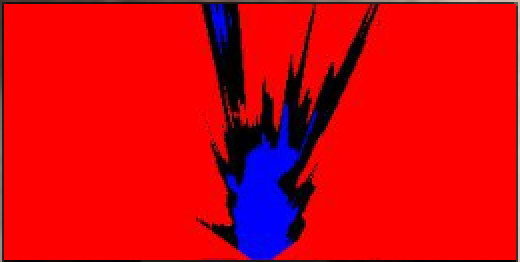
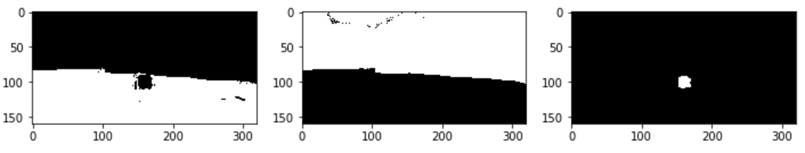
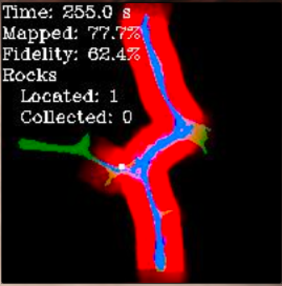
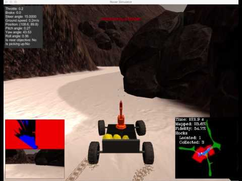

## Project: Search and Sample Return

---


**The goals / steps of this project are the following:**

**Training / Calibration**

* Download the simulator and take data in "Training Mode"
* Test out the functions in the Jupyter Notebook provided
* Add functions to detect obstacles and samples of interest (golden rocks)
* Fill in the `process_image()` function with the appropriate image processing steps (perspective transform, color threshold etc.) to get from raw images to a map.  The `output_image` you create in this step should demonstrate that your mapping pipeline works.
* Use `moviepy` to process the images in your saved dataset with the `process_image()` function.  Include the video you produce as part of your submission.

**Autonomous Navigation / Mapping**

* Fill in the `perception_step()` function within the `perception.py` script with the appropriate image processing functions to create a map and update `Rover()` data (similar to what you did with `process_image()` in the notebook).
* Fill in the `decision_step()` function within the `decision.py` script with conditional statements that take into consideration the outputs of the `perception_step()` in deciding how to issue throttle, brake and steering commands.
* Iterate on your perception and decision function until your rover does a reasonable (need to define metric) job of navigating and mapping.


## [Rubric](https://review.udacity.com/#!/rubrics/916/view) Points
<!-- ### Here I will consider the rubric points individually and describe how I addressed each point in my implementation. -->


---
### Writeup / README

<!-- #### 1. Provide a Writeup / README that includes all the rubric points and how you addressed each one.  You can submit your writeup as markdown or pdf. -->

<!-- Writeup provided in markdown format on Github. -->

### Notebook Analysis
#### 1. Run the functions provided in the notebook on test images (first with the test data provided, next on data you have recorded). Add/modify functions to allow for color selection of obstacles and rock samples.

<!-- Describe in your writeup (and identify where in your code) how you modified or added functions to add obstacle and rock sample identification. -->

Using the calibration image (`'../calibration_images/example_rock1.jpg'`) as a test, I altered the `color_thresh` function so that it would indicate the presence of a rock sample. Specifically, I took the suggested method of adding a `rbg_thresh_max` parameter such that color selection could occur within a specified range (comments removed for brevity):

```python
def color_thresh(img, rgb_thresh_min=(160, 160, 160), rgb_thresh_max=(255, 255, 255)):
    color_select = np.zeros_like(img[:,:,0])
    thresh_select = (rgb_thresh_min[0] <= img[:,:,0]) & (img[:,:,0] <= rgb_thresh_max[0]) \
                  & (rgb_thresh_min[1] <= img[:,:,1]) & (img[:,:,1] <= rgb_thresh_max[1]) \
                  & (rgb_thresh_min[2] <= img[:,:,2]) & (img[:,:,2] <= rgb_thresh_max[2])
    color_select[thresh_select] = 1
    return color_select
```

I used the default values for detecting navigable terrain and I tried two methods for selecting obstacles. Finally, I used an RGB chart to empirically select thresholds for the rock samples.

```python
navigable_terrain = color_thresh(warped)
rock_samples = color_thresh(warped, rgb_thresh_min=(100, 100, 0), rgb_thresh_max=(255,255,80))

# Obstacles attempt 1
obstacles = -(navigable_terrain - 1)

# Obstacles attempt 2
obstacles = color_thresh(warped, rgb_thresh_min=(0, 0, 0), rgb_thresh_max=(120, 120, 120))
```

In the first attempt, I simply used the negation of the `navigable_terrain` variable. However, I noticed that this had a negative impact on map fidelity. Attempt 2 does a better job of finding "definite" obstacles. Note: as shown below, this does mean that some parts of the image remain unclassified.



The image below shows the images generated with regards to the sample rock image.




#### 1. Populate the `process_image()` function with the appropriate analysis steps to map pixels identifying navigable terrain, obstacles and rock samples into a worldmap.  Run `process_image()` on your test data using the `moviepy` functions provided to create video output of your result.

<!-- Describe in your writeup how you modified the process_image() to demonstrate your analysis and how you created a worldmap. Include your video output with your submission. -->

For the most part, I followed the provided instructions. I used the `source` and `destination` values assigned by default, I used the default `perspect_transfrom` image, I called my modified `color_thresh` function (three times), I called `rover_coords` (three times), I called pix_to_world (three times), and I updated the world map. As for the mosaic output, I did add the `navigable_terrain` image to the lower right-hand side of the output image, and I also played with the strength at which the `worldmap` was updated by the thresholded images (as shown in the following snippet).

```python
color_strength = 1
data.worldmap[nav_y_world, nav_x_world, 2] += color_strength
data.worldmap[obs_y_world, obs_x_world, 0] += color_strength
data.worldmap[roc_y_world, roc_x_world, 1] += color_strength
```

A video showing a custom set of test data can be found here: [Sample Output](../output/test_mapping.mp4).

### Autonomous Navigation and Mapping

#### 1. Fill in the `perception_step()` (at the bottom of the `perception.py` script) and `decision_step()` (in `decision.py`) functions in the autonomous mapping scripts and an explanation is provided in the writeup of how and why these functions were modified as they were.

<!-- perception_step() and decision_step() functions have been filled in and their functionality explained in the writeup. -->

**`perception_step()`** was filled in by transforming the `process_image()` function from the notebook (described above). One minor change that I've added is that the `source` and `destination` values are only calculated once:

```python
if not hasattr(Rover, 'source'):
    Rover.source = np.float32([[14, 140], [301 ,140],[200, 96], [118, 96]])
if not hasattr(Rover, 'destination'):
    im_shape = Rover.img.shape
    dst_size_half = 5
    Rover.destination = np.float32([
        [im_shape[1]/2 - dst_size_half, im_shape[0]],
        [im_shape[1]/2 + dst_size_half, im_shape[0]],
        [im_shape[1]/2 + dst_size_half, im_shape[0] - 2*dst_size_half],
        [im_shape[1]/2 - dst_size_half, im_shape[0] - 2*dst_size_half]])
```

The code is not very Pythonic (LBYL rather than EAFP) instead of , but it works and is more inline with the provided code. One other minor change is the addition of rock sample image information:

```python
Rover.roc_dists, Rover.roc_angles = to_polar_coords(roc_x, roc_y)
```

As for **`decision_step()`**, I chose to completely rewrite it in an easier to follow/update manner. First, I check that vision data is available:

```python
# Wait for vision data
if Rover.nav_angles == None:
    return Rover
```

Next, I check the current state and its transitions:

```python
if Rover.mode == 'forward':

    # Rotate when the rover runs out of space in front
    if navigable_space_left < Rover.stop_forward or navigable_space_right < Rover.stop_forward or \
       Rover.stuck_counter > 100:
        Rover.mode = 'stop'

    # Steer towards rock samples
    elif rock_space >= Rover.go_to_sample:
        Rover.mode = 'goto_sample'

elif Rover.mode == 'stop':

    # Rotate once the rover is stopped
    if Rover.vel < 0.2:
        Rover.mode = 'rotate_left'

elif Rover.mode == 'something_else':
    more_code_here = True
```

Finally, I have the actions for each state:

```python
if Rover.mode == 'forward':

    Rover.throttle = Rover.throttle_set if Rover.vel < Rover.max_vel else 0
    Rover.brake = 0

    # Go forward, but hug the right wall
    steer = np.mean(Rover.nav_angles * 180 / np.pi)
    if navigable_space_right > Rover.stop_forward * 2:
        steer -= 3
    Rover.steer = np.clip(steer, -15, 15)

elif Rover.mode == 'stop':

    # Stop the rover
    Rover.throttle = 0
    Rover.brake = Rover.brake_set
    Rover.steer = 0
```

I tried several methods for wall hugging and smoother navigation, but I found that the simpler, jerkier motion proved to more effective.


#### 2. Launching in autonomous mode your rover can navigate and map autonomously.  Explain your results and how you might improve them in your writeup.

<!-- By running drive_rover.py and launching the simulator in autonomous mode, your rover does a reasonably good job at mapping the environment. -->

<!-- The rover must map at least 40% of the environment with 60% fidelity (accuracy) against the ground truth. You must also find (map) the location of at least one rock sample. They don't need to pick any rocks up, just have them appear in the map (should happen automatically if their map pixels in Rover.worldmap[:,:,1] overlap with sample locations.) -->

<!-- Note: running the simulator with different choices of resolution and graphics quality may produce different results, particularly on different machines! Make a note of your simulator settings (resolution and graphics quality set on launch) and frames per second (FPS output to terminal by drive_rover.py) in your writeup when you submit the project so your reviewer can reproduce your results. -->

**Setup**:

- OS: macOS Sierra (10.12.5)
- Simulator resolution: 1025 x 768
- Simulator graphics quality: Good
- Frames per second (FPS): 38

Depending on the settings in my perception and decision steps I can get varying degrees of success with object detection, map fidelity, and object recovery. At minimum, I was able to satisfy requirements of the project:



Additionally, I added states to the decision tree for identifying, navigating toward, and picking up rock samples. These can be found in `decision.py`, but to summarize: if I detect a sample while in the forward or rotating states I go to the `goto_sample` state. In this state, I slowly approach the rock sample, stop when close, and then pick it up if possible. Below is a screen-shot from [this movie in which the rover picks up five samples](https://youtu.be/WeONxQc-qHM).



Although time has not permitted, in the future I would spend a greater amount of time working on the wall-hugging feature. It does not work well, and in general causes a jerkiness that lowers the map fidelity. It seems that I had to sacrifice either map fidelity or sample collection with no good reason.
